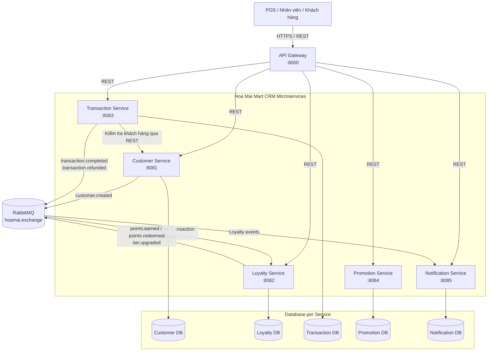

# Hoa Mai Mart Loyalty & CRM POC

Hệ thống microservices minh họa quản lý khách hàng, giao dịch POS, tích/đổi/hoàn điểm, tier, promotion và notification.

## Kiến trúc tổng thể



Luồng request đi qua API Gateway; mỗi service sở hữu database riêng. Các thao tác cần phản hồi ngay dùng REST, còn việc đồng bộ loyalty và tạo notification dùng event qua RabbitMQ.

## 1. Yêu cầu môi trường

- JDK 21
- Maven 3.9+
- Docker và Docker Compose
- `curl` để chạy smoke test (không bắt buộc)

Kiểm tra:

```bash
java -version
mvn -version
docker compose version
```

## 2. Các service

| Service | Port | Swagger UI | Database |
|---|---:|---|---|
| API Gateway | 8000 | `http://localhost:8000/swagger-ui.html` | Không có |
| Customer | 8081 | `http://localhost:8081/swagger-ui.html` | `hoa_mai_customer` |
| Loyalty | 8082 | `http://localhost:8082/swagger-ui.html` | `hoa_mai_loyalty` |
| Transaction | 8083 | `http://localhost:8083/swagger-ui.html` | `hoa_mai_transaction` |
| Promotion | 8084 | `http://localhost:8084/swagger-ui.html` | `hoa_mai_promotion` |
| Notification | 8085 | `http://localhost:8085/swagger-ui.html` | `hoa_mai_notification` |

RabbitMQ Management UI: `http://localhost:15672` (`guest` / `guest`).

## 3. Khởi động hạ tầng

Từ thư mục gốc dự án:

```bash
docker compose -f infra/docker-compose.yml up -d
docker compose -f infra/docker-compose.yml ps
```

Docker Compose tạo RabbitMQ và 5 PostgreSQL instance:

| Database | Host port | Username | Password |
|---|---:|---|---|
| Customer | 5441 | `crm_user` | `change-me` |
| Loyalty | 5442 | `crm_user` | `change-me` |
| Transaction | 5443 | `crm_user` | `change-me` |
| Promotion | 5444 | `crm_user` | `change-me` |
| Notification | 5445 | `crm_user` | `change-me` |

> Các file `application.yml` mặc định trỏ tới PostgreSQL local `localhost:5432` với `postgres/postgres`. Các lệnh chạy bên dưới override cấu hình để sử dụng Docker Compose.

## 4. Build dự án

```bash
mvn clean install -DskipTests
```

Chạy test:

```bash
mvn test
```

## 5. Khởi động ứng dụng

Mở terminal riêng cho từng service. Nên khởi động consumer trước producer theo thứ tự dưới đây.

### 5.1 Loyalty Service

```bash
SPRING_DATASOURCE_URL=jdbc:postgresql://localhost:5442/hoa_mai_loyalty \
SPRING_DATASOURCE_USERNAME=crm_user \
SPRING_DATASOURCE_PASSWORD=change-me \
mvn -pl loyalty-service spring-boot:run
```

### 5.2 Notification Service

```bash
SPRING_DATASOURCE_URL=jdbc:postgresql://localhost:5445/hoa_mai_notification \
SPRING_DATASOURCE_USERNAME=crm_user \
SPRING_DATASOURCE_PASSWORD=change-me \
mvn -pl notification-service spring-boot:run
```

### 5.3 Promotion Service

```bash
SPRING_DATASOURCE_URL=jdbc:postgresql://localhost:5444/hoa_mai_promotion \
SPRING_DATASOURCE_USERNAME=crm_user \
SPRING_DATASOURCE_PASSWORD=change-me \
mvn -pl promotion-service spring-boot:run
```

### 5.4 Customer Service

```bash
SPRING_DATASOURCE_URL=jdbc:postgresql://localhost:5441/hoa_mai_customer \
SPRING_DATASOURCE_USERNAME=crm_user \
SPRING_DATASOURCE_PASSWORD=change-me \
mvn -pl customer-service spring-boot:run
```

### 5.5 Transaction Service

```bash
SPRING_DATASOURCE_URL=jdbc:postgresql://localhost:5443/hoa_mai_transaction \
SPRING_DATASOURCE_USERNAME=crm_user \
SPRING_DATASOURCE_PASSWORD=change-me \
mvn -pl transaction-service spring-boot:run
```

### 5.6 API Gateway

```bash
mvn -pl api-gateway spring-boot:run
```

## 6. Kiểm tra trạng thái

```bash
curl http://localhost:8000/actuator/health
curl http://localhost:8081/actuator/health
curl http://localhost:8082/actuator/health
curl http://localhost:8083/actuator/health
curl http://localhost:8084/actuator/health
curl http://localhost:8085/actuator/health
```

Kết quả mong đợi:

```json
{"status":"UP"}
```

## 7. Smoke test end-to-end

### 7.1 Tạo customer

```bash
curl -X POST http://localhost:8081/api/customers \
  -H 'Content-Type: application/json' \
  -d '{"phone":"0901234567","name":"Nguyen Van A"}'
```

Lấy `customerId` từ response. Event `customer.created` sẽ tạo loyalty account với 0 điểm và tier `BRONZE`.

### 7.2 Kiểm tra loyalty account

```bash
curl http://localhost:8082/api/v1/customers/<CUSTOMER_ID>/loyalty
```

### 7.3 Tạo giao dịch

```bash
curl -X POST http://localhost:8083/api/v1/pos/transactions \
  -H 'Content-Type: application/json' \
  -d '{
    "customerId":"<CUSTOMER_ID>",
    "storeId":"STORE-001",
    "transactionCode":"POS-20260901-000001",
    "amount":1000000
  }'
```

Rule hiện tại: `floor(amount / 10.000 VND)`. Giao dịch 1.000.000 VND tạo 100 điểm.

### 7.4 Kiểm tra balance và lịch sử điểm

```bash
curl http://localhost:8082/api/v1/customers/<CUSTOMER_ID>/loyalty
curl http://localhost:8082/api/v1/customers/<CUSTOMER_ID>/loyalty/points/history
```

### 7.5 Kiểm tra notification

```bash
curl http://localhost:8085/api/notifications/customers/<CUSTOMER_ID>
curl http://localhost:8085/api/notifications/customers/<CUSTOMER_ID>/unread/count
```

## 8. Luồng sự kiện

| Routing key | Producer | Consumer |
|---|---|---|
| `customer.created` | Customer Service | Loyalty Service |
| `transaction.completed` | Transaction Service | Loyalty Service |
| `transaction.refunded` | Transaction Service | Loyalty Service |
| `loyalty.points.earned` | Loyalty Service | Notification Service |
| `loyalty.points.redeemed` | Loyalty Service | Notification Service |
| `loyalty.tier.upgraded` | Loyalty Service | Notification Service |

Exchange mặc định: `hoamai.exchange`.

## 9. Lỗi thường gặp

### Port đã được sử dụng

```bash
ss -ltnp | grep -E ':8000|:8081|:8082|:8083|:8084|:8085|:5672'
```

Stop process/service cũ trước khi chạy lại để tránh sử dụng bytecode cũ.

### Không kết nối được PostgreSQL

Kiểm tra container và port:

```bash
docker compose -f infra/docker-compose.yml ps
```

Đảm bảo dùng đúng biến `SPRING_DATASOURCE_*` tại mục 5.

### Event không được xử lý

1. Mở RabbitMQ UI tại `http://localhost:15672`.
2. Kiểm tra exchange `hoamai.exchange`, queue, binding và consumer.
3. Kiểm tra cả producer và consumer đang chạy phiên bản mới nhất.
4. Dùng `transactionCode` mới khi thử lại do idempotency.

Message gặp fatal conversion error có thể bị reject/drop nếu chưa cấu hình DLQ; cần phát sinh event mới sau khi sửa.

## 10. Dừng môi trường

Dừng service Java bằng `Ctrl+C` trong từng terminal.

```bash
docker compose -f infra/docker-compose.yml down
```

Xóa cả dữ liệu local của container:

```bash
docker compose -f infra/docker-compose.yml down -v
```

Lệnh `down -v` xóa dữ liệu PostgreSQL và RabbitMQ trong Docker; chỉ dùng khi muốn reset môi trường.
