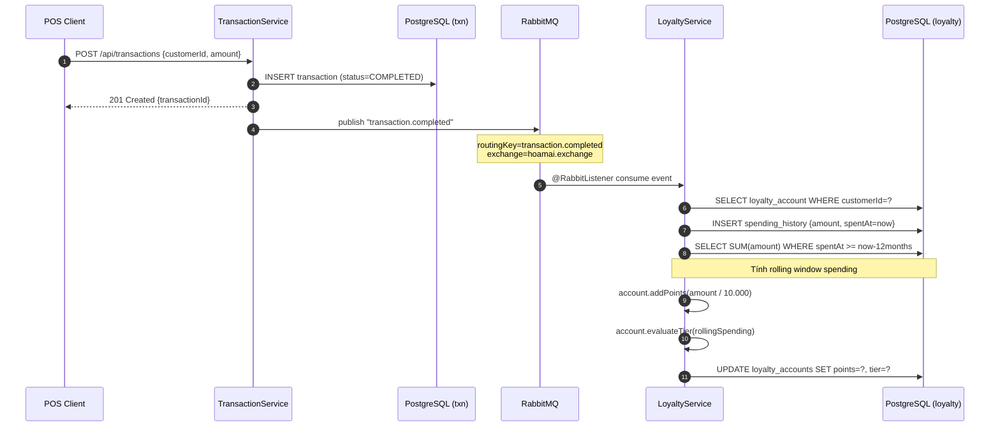
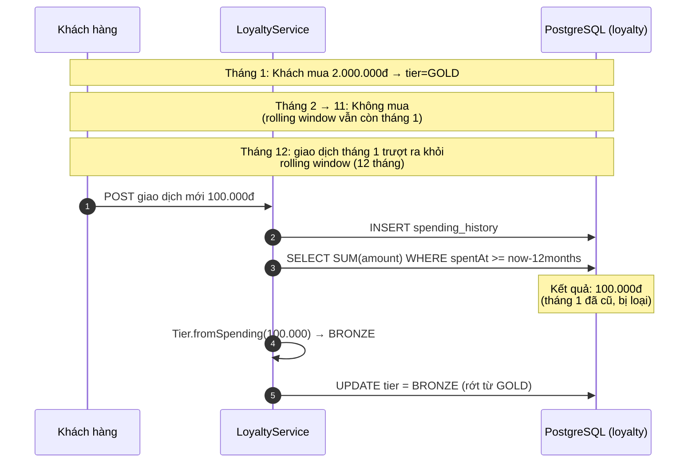
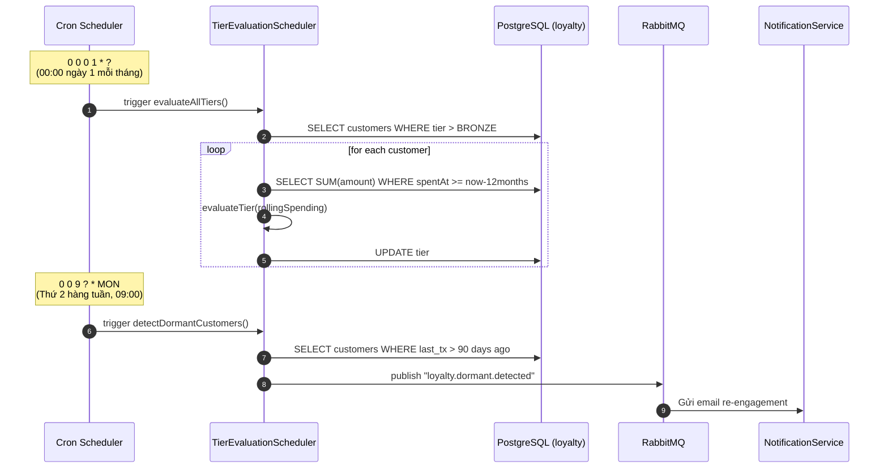

# Loyalty Service — Sequence Diagrams

## 1. Khách mua hàng → cộng điểm + cập nhật tier



## 2. Khách ngừng mua → tự rớt hạng



## 3. Cron job đánh giá tier hàng tháng



## Tier Thresholds

| Tier | Chi tiêu 12 tháng | Mục đích FMCG |
|------|-------------------|---------------|
| BRONZE | < 500.000đ | Mặc định |
| SILVER | ≥ 500.000đ | Quay lại ~1 lần/tuần |
| GOLD | ≥ 2.000.000đ | Khách trung thành |
| PLATINUM | ≥ 10.000.000đ | VIP |

## Cron schedule

| Cron | Mô tả |
|------|-------|
| `0 0 0 1 * ?` | Đánh giá tier tất cả khách |
| `0 0 2 1 * ?` | Cleanup spending_history > 13 tháng |
| `0 0 9 ? * MON` | Phát hiện dormant (>90 ngày) |
| `0 0 10 20 * ?` | Cảnh báo sắp rớt hạng |

## Tại sao rolling window cho FMCG?

```
❌ Cách cũ: tier theo tổng điểm tích lũy (lifetime)
   → Khách mua 1 lần 100tr vẫn Platinum cả đời (không công bằng)

✅ Cách mới: tier theo rolling window 12 tháng
   → Khách ngừng mua → tự rớt hạng (chính xác, fair)
   → FMCG = mua lặp lại thường xuyên → khuyến khích tần suất
   → Cleanup tự động: data > 13 tháng bị xóa (DB nhẹ)
```